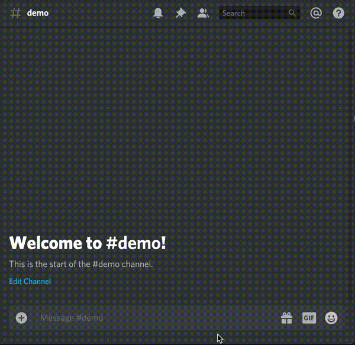

# Odin ⚡

Odin is a Discord tipping bot. It allows users to deposit and withdraw Bitcoin via the [lightning network](https://lightning.network). Users can tip each other with the Bitcoin they deposit or receive, and can later withdraw to an external lightning wallet.



## Installation

Clone the repository:
```bash
git clone git@github.com:hugomd/odin.git
```

Install dependencies:
```bash
npm i
```

Modify database configuration in [`src/config/config.js`](./src/config/config.js), or set `NODE_ENV=production` and set the Postgres environment variables defined below.

Create the database and run migrations:
```bash
npx sequelize-cli db:create
npx sequelize-cli db:migrate
```

Start the bot:
```bash
npm start
```


### Environment variables
#### Postgres
* `DB_USERNAME`
* `DB_PASSWORD`
* `DB_DATABASE`
* `DB_HOST`

#### Lightning
* `LND_IP`
* `LND_PORT`
* `MACAROON_BASE64`

### Generate a new macaroon
```bash
lncli bakemacaroon invoices:read invoices:write message:read message:write offchain:read offchain:write --save_to odin.macaroon
```

Convert it to base64:
```bash
 xxd -ps -u -c 1000 odin.macaroon
```

## Related projects
* [lnd-invoice](https://github.com/hugomd/lnd-invoice)

## License
MIT, see [LICENSE](./LICENSE).
